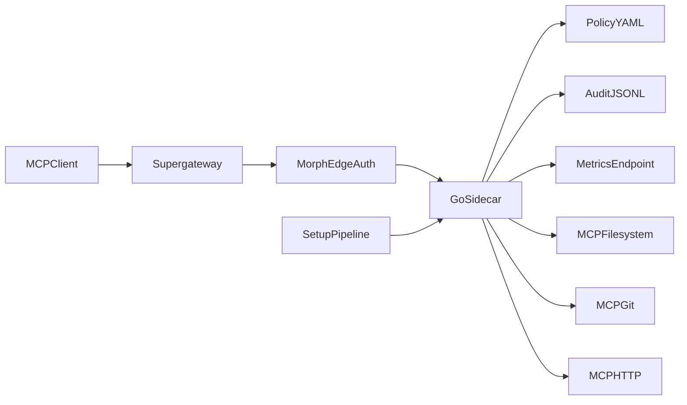

<div align="center">

# MCP Sidecar Demo

**Remote MCP over HTTP, with a policy-aware Go sidecar on Morph Cloud.**

</div>

This repository is a small, end-to-end reference: provision a VM, route three MCP backends through one sidecar, expose authenticated URLs, and ship ready-made client configs. The sidecar enforces YAML policy, writes redacted audit lines, and is covered by the same quality gates you would expect in a production service.

---

## At a glance

| Layer | What you get |
|-------|----------------|
| Edge | Morph-exposed HTTP services with API-key authentication |
| Proxy | Go sidecar: policy checks, reverse proxy, `/health`, `/ready`, `/metrics` |
| Backends | Filesystem, Git, and HTTP MCP servers on localhost inside the VM |
| Clients | Generated Cursor and Claude Desktop configs using `supergateway` |
| Quality | Ruff, mypy, pytest, and Go tests in CI and via `make ci` |

---

## Why this exists

Building remote MCP access is more than exposing a port: you need predictable auth boundaries, a single place to enforce rules, and logs you can trust. This demo keeps the provisioning story in Python (fast iteration) and the dataplane in Go (simple, explicit HTTP handling). Policy and config are validated at startup so the process does not run half-configured.

**Documentation in this repo:** this file is the main guide. Contributor expectations are in [CONTRIBUTING.md](CONTRIBUTING.md).

---

## Architecture



Clients speak MCP over stdio; `supergateway` bridges to SSE URLs. Morph terminates API-key auth at the edge. The sidecar applies policy, proxies to the right local MCP port, and records decisions.

---

## Repository map

| Path | Role |
|------|------|
| [setup/setup_mcp.py](setup/setup_mcp.py) | Snapshot, build, deploy sidecar, start services, expose URLs |
| [sidecar/main.go](sidecar/main.go) | Sidecar: routing, policy, audit, proxy |
| [sidecar/config.yaml](sidecar/config.yaml) | Runtime config (timeouts, auth, reload interval) |
| [sidecar/policy.yaml](sidecar/policy.yaml) | Policy shipped with the sidecar build |
| [tests/](tests/) | Python unit tests (offline) |
| [sidecar/main_test.go](sidecar/main_test.go) | Go unit tests |
| [smoke_test.py](smoke_test.py) | Post-deploy smoke checks (requires Morph) |
| [test_epoch_rotation.py](test_epoch_rotation.py) | Epoch rotation integration test (requires Morph) |
| [Makefile](Makefile) | Commands: setup, test, logs, `ci`, and more |
| [.github/workflows/ci.yml](.github/workflows/ci.yml) | Pull request and push checks |

After `make setup`, you will have `instance_info.json` (ignored by git) and refreshed files under `clients/`.

---

## Quickstart

```bash
make install-deps
export MORPH_API_KEY="your-api-key"
make setup
make test
```

End-to-end shortcut (install deps, setup, then smoke test):

```bash
make demo
```

Outputs:

- `instance_info.json` — instance id and Morph base URLs  
- `clients/cursor.json` and `clients/claude-desktop.json` — `supergateway` wiring for each route  

---

## HTTP surface (sidecar)

Inside the VM the sidecar listens on port `8080`. Morph publishes each service at its own base URL; paths are appended to that base (see [smoke_test.py](smoke_test.py)).

| Method | Path | Purpose |
|--------|------|---------|
| `GET` | `/health` | Liveness |
| `GET` | `/ready` | Readiness |
| `GET` | `/metrics` | Expvar metrics |
| `GET` | `/mcp1/sse` | Filesystem MCP (via proxy) |
| `GET` | `/mcp2/sse` | Git MCP |
| `GET` | `/mcp3/sse` | HTTP MCP |

### Quick manual checks

After `make setup`, you can probe the first exposed base URL (see `instance_info.json`):

```bash
BASE="$(python -c "import json; print(json.load(open('instance_info.json'))['urls']['mcp1'])")"
curl -fsS -H "Authorization: Bearer $MORPH_API_KEY" "$BASE/health"
curl -fsS -H "Authorization: Bearer $MORPH_API_KEY" "$BASE/ready"
```

SSE endpoints may keep the connection open; interrupt with Ctrl+C when you are done.

---

## Security and policy

- Edge: Morph `auth_mode="api_key"` on exposed HTTP services.  
- Sidecar (optional): bearer checks via `auth.*` in [sidecar/config.yaml](sidecar/config.yaml).  
- Authorization: `default` role, epochs, tools, and `call` permission in [sidecar/policy.yaml](sidecar/policy.yaml).  
- Audit: JSONL on the VM at `/opt/sidecar/permits.jsonl`; bearer material is never written verbatim.  

Config path: set `SIDECAR_CONFIG` (for example `/opt/sidecar/config.yaml` on the VM), otherwise `./config.yaml` from the process working directory.

---

## Startup guarantees

The sidecar exits on invalid config or policy instead of running in an undefined state. Examples include missing `policy.file`, bad durations, bad upstream URLs, invalid RFC3339 epoch expiry, a missing `default` role, or epoch names that do not exist.

If `policy.reload_interval` is set, policy is reloaded on that schedule without restarting the process.

---

## Develop and verify

```bash
make ci
```

Runs Ruff, mypy on selected modules, pytest, and `go test` under `sidecar/`. Optional race detection (toolchain-dependent):

```bash
make race
```

---

## Day-two commands

```bash
make status
make logs
make epoch-rotate
make clean
```

`make logs` uses your saved instance id and Morph credentials to print recent sidecar and permit log tails.

---

## Requirements

| Component | Version |
|-----------|---------|
| Python | 3.9+ (CI uses 3.11) |
| Go | 1.21+ (`sidecar/`) |
| Node.js | 18+ (`npx`, client configs) |
| Morph | Account with `MORPH_API_KEY` for provision and integration tests |

On Windows, use Git Bash, WSL, or another environment that provides `make` and a POSIX shell, or invoke the same Python entrypoints as in the [Makefile](Makefile).

---

## Troubleshooting

| Symptom | What to try |
|---------|-------------|
| Setup or tests say API key missing | `export MORPH_API_KEY=...` and retry |
| Go build or test failures | `cd sidecar && go test ./...` |
| Odd runtime behavior | `make logs`, then re-read [sidecar/config.yaml](sidecar/config.yaml) and [sidecar/policy.yaml](sidecar/policy.yaml) |
| `make` not available | Install a Make implementation or run the commands from the [Makefile](Makefile) manually |

---

## Contributing

See [CONTRIBUTING.md](CONTRIBUTING.md).

---

## License

Released under the MIT License. See [LICENSE](LICENSE).
